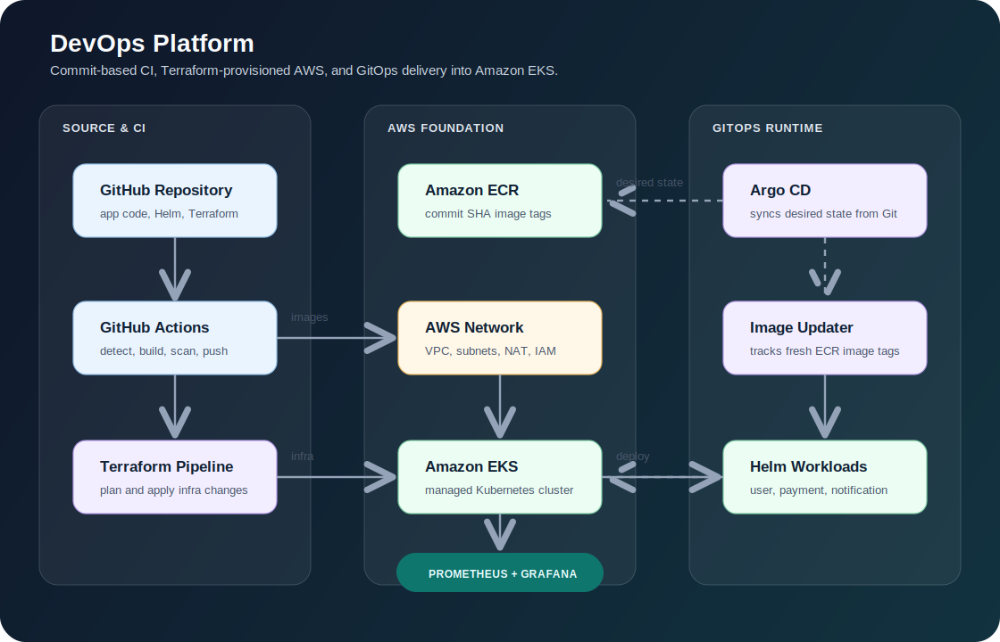

# DevOps Platform


This repository is a hands-on DevOps platform built around a simple but realistic goal: take application code, build it into containers, publish those containers to AWS, and let GitOps deploy the right version into Kubernetes.

It is not just a demo app. The repo brings together infrastructure, CI, Helm packaging, Argo CD, image automation, and monitoring so the deployment flow feels close to how a real platform team would run it.



## Why I Built This

I built this project to show the kind of platform work that usually sits between application teams and cloud infrastructure: repeatable environments, traceable releases, Git-driven deployments, and enough observability to understand what is running after it ships.

The goal was not to create another isolated Kubernetes example. I wanted a portfolio project that connects the full delivery path: Terraform creates the AWS foundation, GitHub Actions produces versioned images, Helm describes the workloads, and Argo CD keeps the cluster aligned with Git.

## What This Platform Does

- Provisions AWS infrastructure with Terraform.
- Creates a VPC, private/public subnets, EKS, node groups, and ECR repositories.
- Builds microservice Docker images with GitHub Actions.
- Pushes images to Amazon ECR using commit SHAs as image tags.
- Packages Kubernetes workloads with Helm charts.
- Uses Argo CD as the GitOps controller.
- Uses Argo CD Image Updater to track and update image versions.
- Installs monitoring with Prometheus and Grafana through Argo CD applications.

## Architecture

```text
                                      +----------------------+
                                      |      Developer       |
                                      +----------+-----------+
                                                 |
                                                 | push code / infra changes
                                                 v
                                      +----------------------+
                                      |   GitHub Repository  |
                                      | app code, Helm, IaC  |
                                      +----+------------+----+
                                           |            |
                    application changes    |            | infrastructure changes
                                           |            |
                                           v            v
                              +------------------+   +------------------+
                              | GitHub Actions   |   | Terraform        |
                              | CI Pipeline      |   | IaC Pipeline     |
                              +--------+---------+   +--------+---------+
                                       |                      |
                                       | build, scan, push    | provision / update
                                       v                      v
                              +------------------+   +------------------+
                              | Amazon ECR       |   | AWS Foundation   |
                              | container images |   | VPC, EKS, ECR    |
                              +--------+---------+   +--------+---------+
                                       |                      |
                                       | image versions       | cluster runtime
                                       v                      v
+----------------------+      +------------------+   +------------------+
| Argo CD Image        |----->| GitOps Manifests |-->| Amazon EKS       |
| Updater              |      | Helm + Argo Apps |   | Kubernetes       |
+----------------------+      +--------+---------+   +--------+---------+
                                       ^                      |
                                       | sync desired state   | workloads
                              +--------+---------+            v
                              | Argo CD          |   +------------------+
                              | GitOps Controller|   | Microservices    |
                              +------------------+   | user/payment/    |
                                                     | notification     |
                                                     +--------+---------+
                                                              |
                                                              | metrics / health
                                                              v
                                                     +------------------+
                                                     | Observability    |
                                                     | Prometheus +     |
                                                     | Grafana          |
                                                     +------------------+
```

The platform is split into clear responsibilities:

- Source control keeps application code, Helm charts, Terraform, and Argo CD manifests together.
- CI builds changed microservices, scans the images, and publishes versioned artifacts to ECR.
- Terraform owns the AWS foundation: VPC, EKS, node groups, and container registries.
- Argo CD owns Kubernetes deployment by syncing Helm-based applications from Git.
- Argo CD Image Updater bridges ECR and GitOps by tracking new image versions.
- Prometheus and Grafana provide the observability layer for the cluster and workloads.

The rule of the platform is simple: CI creates artifacts, Git stores desired state, and Argo CD keeps Kubernetes aligned with Git.

## Tech Stack

| Area | Tools |
| --- | --- |
| Cloud | AWS |
| Infrastructure | Terraform |
| Kubernetes | Amazon EKS |
| Container Registry | Amazon ECR |
| CI | GitHub Actions |
| CD / GitOps | Argo CD |
| Packaging | Helm |
| Image automation | Argo CD Image Updater |
| Security scan | Trivy |
| Monitoring | Prometheus, Grafana |

## Repository Layout

```text
DevOps-Platform/
|-- application-microservices/
|   |-- user-service/
|   |-- payment-service/
|   `-- notification-service/
|
|-- helm/
|   |-- user-service/
|   |-- payment-service/
|   `-- notification-service/
|
|-- infra/
|   `-- terraform/
|       |-- bootstrap/
|       |-- environments/
|       |   |-- dev/
|       |   |-- test/
|       |   |-- uat/
|       |   `-- prod/
|       `-- modules/
|           |-- vpc/
|           |-- eks/
|           `-- ecr/
|
|-- platform/
|   `-- argocd/
|       `-- applications/
|           `-- dev/
|               |-- root-app.yaml
|               |-- user-service-dev.yaml
|               |-- image-updater.yaml
|               `-- monitoring/
|                   |-- prometheus-app.yaml
|                   `-- grafana.yaml
|
|-- k8s-manifests/
|-- platform-addons/
`-- .github/workflows/
    |-- ci.yaml
    |-- reusable-build.yaml
    `-- terraform.yaml
```

## Application Services

The repo currently contains three Python-based microservices:

- `user-service`
- `payment-service`
- `notification-service`

Each service has its own `Dockerfile` and application code under `application-microservices/`.

Helm charts exist for the services under `helm/`. The `user-service` is currently wired into Argo CD for the dev environment through:

```text
platform/argocd/applications/dev/user-service-dev.yaml
```

The payment and notification services have chart structure in place and can be connected to Argo CD in the same pattern.

## Infrastructure

Terraform code lives under:

```text
infra/terraform/
```

The bootstrap layer creates the remote state foundation:

- S3 bucket for Terraform state
- DynamoDB table for state locking

The dev environment currently provisions:

- VPC
- Public and private subnets
- Internet Gateway
- NAT Gateway
- EKS cluster
- EKS managed node group
- ECR repositories for the services

The EKS cluster name is built as:

```text
dev-platform
```

## CI Flow

The CI workflow is defined in:

```text
.github/workflows/ci.yaml
.github/workflows/reusable-build.yaml
```

When files under `application-microservices/` change, the pipeline:

1. Detects which service changed.
2. Builds only the changed service image.
3. Tags the image with the Git commit SHA.
4. Scans the image with Trivy.
5. Pushes the image to Amazon ECR.

Using commit SHAs makes deployments traceable. If something breaks, it is easy to see exactly which source revision produced the running image.

## GitOps Flow

Argo CD application manifests live in:

```text
platform/argocd/applications/dev/
```

The main app-of-apps entry point is:

```text
platform/argocd/applications/dev/root-app.yaml
```

That root application points Argo CD at the dev application folder. From there, Argo CD manages:

- `user-service`
- `argocd-image-updater`
- Prometheus
- Grafana

The `user-service` app deploys the Helm chart from:

```text
helm/user-service
```

and uses dev values from:

```text
helm/user-service/values-dev.yaml
```

## Image Updates

Argo CD Image Updater is configured in:

```text
platform/argocd/applications/dev/image-updater.yaml
```

The user service has image updater annotations in:

```text
platform/argocd/applications/dev/user-service-dev.yaml
```

Those annotations tell Image Updater which ECR image to watch and which Helm values control the image repository and tag.

In the Helm chart, the important fields are:

```yaml
image:
  registry: <aws-account-id>.dkr.ecr.<aws-region>.amazonaws.com
  repository: dev-user-service
  tag: <commit-sha>
  pullPolicy: Always
```

## Monitoring

Monitoring is managed through Argo CD applications:

```text
platform/argocd/applications/dev/monitoring/prometheus-app.yaml
platform/argocd/applications/dev/monitoring/grafana.yaml
```

Prometheus is installed using `kube-prometheus-stack`, and Grafana is installed from the Grafana Helm chart.

This gives the cluster a base observability layer for nodes, pods, workloads, and Kubernetes health.

## Running the Platform

### 1. Create Terraform Remote State

```powershell
cd infra/terraform/bootstrap
terraform init
terraform apply
```

### 2. Provision the Dev Infrastructure

```powershell
cd ../environments/dev
terraform init
terraform plan
terraform apply
```

### 3. Configure kubectl

```powershell
aws eks update-kubeconfig --region us-east-1 --name dev-platform
```

### 4. Install Argo CD

```powershell
kubectl create namespace argocd
kubectl apply -n argocd -f https://raw.githubusercontent.com/argoproj/argo-cd/stable/manifests/install.yaml
```

### 5. Bootstrap the Root Application

```powershell
kubectl apply -f platform/argocd/applications/dev/root-app.yaml
```

After this, Argo CD takes over the application deployment flow.

## Useful Commands

Check Argo CD applications:

```powershell
kubectl -n argocd get applications
```

Check the user service namespace:

```powershell
kubectl -n user-service-dev get all
```

Check image updater logs:

```powershell
kubectl -n argocd logs deploy/argocd-image-updater
```

Validate an Argo CD application manifest before applying:

```powershell
kubectl apply --dry-run=server -f platform/argocd/applications/dev/user-service-dev.yaml
```

## Notes

- `root-app.yaml` currently lives inside the same folder it syncs. This works, but a cleaner long-term layout would keep the bootstrap root app outside the folder managed by the root app.
- The dev environment is the most complete environment in the current repo. Test, UAT, and prod backend files exist, but their full environment definitions can be expanded as the platform matures.
- The older `k8s-manifests/` folder is useful as raw Kubernetes reference material, while Helm is the preferred deployment path for GitOps.

## Why This Project Matters

The project shows the full path from code to cluster:

- Infrastructure is repeatable.
- Images are versioned.
- Deployments are Git-driven.
- Monitoring is part of the platform, not an afterthought.

That is the real value here: the repo is not only deploying a service, it is building the foundation for a platform workflow.
